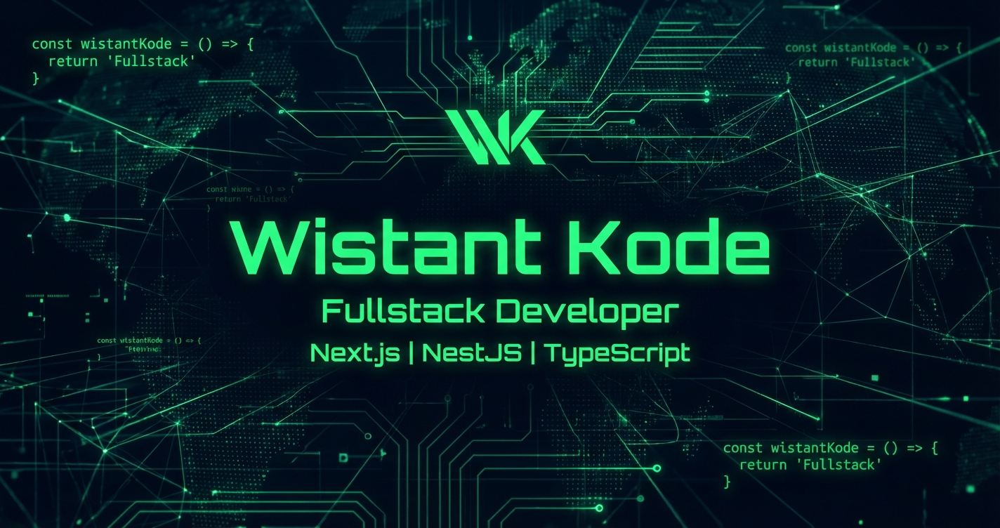

# [English](./README.md) | [Français](./README.fr.md) | [Deutsch](./README.de.md) | [简体中文](./README.zh-CN.md) | [العربية](./README.ar.md)

<!--  -->

### 👋 About Me

<!--  -->

> I am **Wistant**, a self-taught developer and Software Engineering student. I am passionate about building **secure, scalable systems** and **robust architectures**. As a **TypeScript enthusiast**, I specialize in full-stack development using **React/Next.js** for modern front-ends and **Node.js/NestJS** for high-performance back-ends.

> I am deeply committed to **DevOps culture**—mastering containerization, automation, CI/CD pipelines, and cloud technologies to deliver production-ready solutions. I thrive on turning complex ideas into **enterprise-grade IT solutions** that drive impact.

---

### My Tech Arsenal

<table>
  <tr>
    <td align="center" width="50%"><strong>Frontend & Backend</strong></td>
    <td align="center" width="50%"><strong>UI & Styling</strong></td>
  </tr>
  <tr>
    <td align="center">
      
      
      
      
    </td>
    <td align="center">
      
      
      
      
    </td>
  </tr>
</table>

### DevOps & Infrastructure

<table>
  <tr>
    <td align="center" width="33%"><strong>System & Scripting</strong></td>
    <td align="center" width="33%"><strong>Version Control & Cloud</strong></td>
    <td align="center" width="33%"><strong>Containers</strong></td>
  </tr>
  <tr>
    <td align="center">
      
      
      
    </td>
    <td align="center"> 
      
      
      
    </td>
    <td align="center">
      
    </td>
  </tr>
</table>

<!-- ---

### GitHub Analytics

  
  
   
  

 -->

---
vvbbbbb
### Connect with Me

  
  

